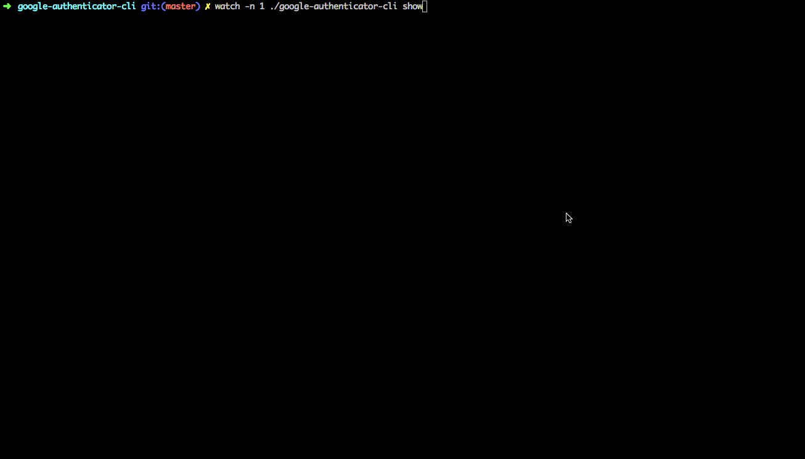

## google-authenticator-cli

Google Authenticator 命令行客户端

## 安装使用

直接[**下载**](https://github.com/chanyipiaomiao/google-authenticator-cli/releases)二级制文件即可

## 使用说明

#### 添加

手动添加
```sh
google-authenticator-cli add --name="aliyun" --secret=xxxxxxxxxxx

--name   指定的是标识，就是为了方便辨认  有空格需要用双引号
--secret 一般跟两步验证二维码一起展示，方便手动添加的
```

识别二维码添加

```sh
./google-authenticator-cli add --name="Test Test" --qrcode=二维码图片路径
```

#### 删除

```sh
google-authenticator-cli delete --delete-name=xxx

--delete-name 和添加功能name里面一样
```

#### 展示6位数字

展示所有

```sh
google-authenticator-cli show
```

```sh
Common 603175 18
第一列 标识
第二列 6位数字
第三列 剩余的时间(秒) 30秒循环一次
```

展示指定的name

name 有空格需要用双引号引起来

```sh
google-authenticator-cli show --show-name="xxxx"
```

#### 保存6位数字到文件

openvpn客户端连接时，有些配置是需要输入Google Authenticator生成的6位数字, 
客户端配置文件中有配置: auth-user-pass pass.txt 可以指定一个文件里面存储用户名和密码，
此功能就是为生成这个文件，方便使用

```sh
google-authenticator-cli save --save-name="VPN" --username=用户名 --path=./pass.txt

--save-name 指定的上面步骤添加的name
--username  指定的openvpn客户端连接时需要输入的用户名
--path      指定文件的路径
```

生成的文件格式如下: 
```sh
用户名
6位数字
```

可以定时调用该命令生成文件

#### 可以使用watch命令动态显示

```sh
watch -n 1 google-authenticator-cli show
```
